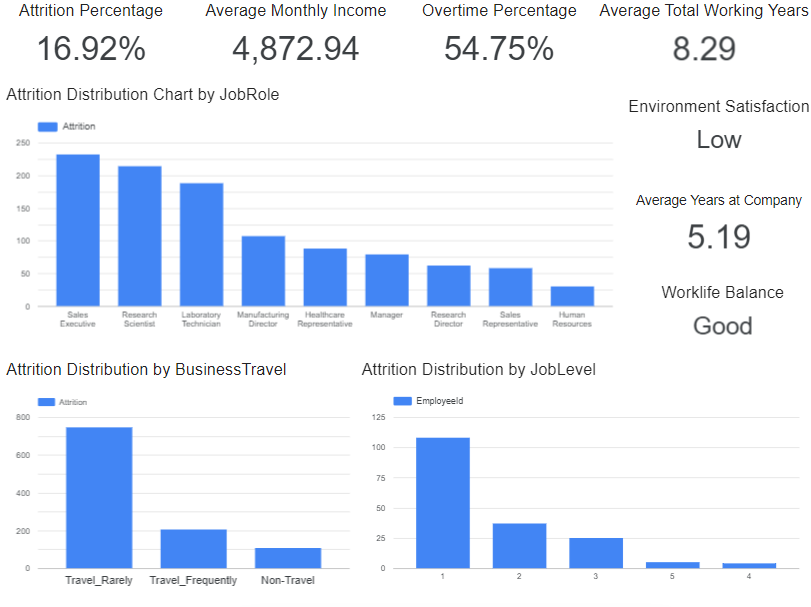

# Proyek Pertama: Menyelesaikan Permasalahan Human Resources

- Nama: Steven Faustin Orginata
- Email: stevenfo0711@gmail.com
- Id Dicoding: stevenfo

## Business Understanding

Jaya Jaya Maju adalah perusahaan multinasional yang telah berdiri sejak tahun 2000 dan kini memiliki lebih dari 1000 karyawan yang tersebar di seluruh penjuru negeri. Meskipun telah berkembang menjadi perusahaan besar, Jaya Jaya Maju masih mengalami tantangan dalam mengelola sumber daya manusianya. Salah satu permasalahan utama yang dihadapi adalah tingginya attrition rate, yaitu lebih dari 10%, yang mengindikasikan bahwa cukup banyak karyawan yang keluar dari perusahaan dalam periode tertentu.

Tingginya tingkat attrition ini menimbulkan kekhawatiran dari pihak manajemen, khususnya dari departemen Human Resources (HR), karena dapat berdampak buruk terhadap stabilitas dan produktivitas perusahaan.

### Permasalahan Bisnis

Berikut adalah beberapa permasalahan bisnis utama yang ingin diselesaikan:
- Mengidentifikasi faktor-faktor yang paling mempengaruhi keputusan karyawan untuk keluar dari perusahaan (attrition).
- Menganalisis data karyawan secara menyeluruh untuk memahami pola-pola yang mungkin menyebabkan tingginya attrition rate.
- Menyediakan visualisasi dan dashboard yang dapat membantu pihak HR dalam memantau dan mengelola faktor-faktor tersebut secara lebih efektif.
- Memberikan rekomendasi berbasis data untuk menurunkan attrition rate ke level yang lebih kecil.

### Cakupan Proyek

Proyek ini akan mencakup hal-hal berikut:
- Eksplorasi dan pembersihan data karyawan dari Jaya Jaya Maju.
- Analisis statistik dan visualisasi untuk mengidentifikasi faktor-faktor penting yang memengaruhi attrition.
- Pembuatan model prediksi (jika diperlukan) untuk mendeteksi potensi karyawan yang mungkin keluar.
- Pengembangan dashboard interaktif untuk HR manager dalam memantau data karyawan dan faktor-faktor attrition secara real-time.
- Penyusunan laporan berisi temuan dan rekomendasi yang dapat ditindaklanjuti oleh manajemen.

### Persiapan

Sumber data: [Dataset](https://github.com/dicodingacademy/dicoding_dataset/tree/main/employee)

Setup environment:

```
:: Buat virtual environment
python -m venv venv

:: Aktifkan virtual environment
venv\Scripts\activate

:: Install semua library yang dibutuhkan dari requirements.txt
pip install -r requirements.txt

```

## Business Dashboard



Dari data yang ditampilkan, diketahui bahwa tingkat attrition mencapai 16.92% dari total populasi karyawan. Salah satu temuan utama adalah bahwa karyawan yang keluar memiliki rata-rata pendapatan bulanan sebesar 4.872,94, yang menunjukkan bahwa sebagian besar dari mereka berada pada level kompensasi menengah ke bawah. Lebih dari separuh (tepatnya 54.75%) karyawan yang resign juga bekerja lembur secara rutin (overtime), mengindikasikan bahwa beban kerja yang tinggi dapat menjadi faktor pendorong utama mereka untuk meninggalkan perusahaan.

Selain itu, karyawan yang keluar memiliki rata-rata pengalaman kerja total sebesar 8.29 tahun, namun masa kerja mereka di perusahaan saat ini hanya sekitar 5.19 tahun. Ini menunjukkan bahwa banyak dari mereka sudah cukup berpengalaman, namun tidak bertahan lama di perusahaan ini—mungkin karena tidak adanya perkembangan karier atau peluang yang lebih baik di tempat lain. Tingkat kepuasan terhadap lingkungan kerja juga dinilai rendah (ditampilkan sebagai "Low"), memperkuat dugaan bahwa aspek non-finansial seperti budaya kerja dan kenyamanan kerja juga menjadi masalah. Di sisi lain, work-life balance rata-rata adalah "Good", yang sebenarnya angka eksaknya berada di antara "Bad" dan "Good", namun tetap tidak cukup untuk menahan karyawan tetap bertahan.

Visualisasi distribusi attrition berdasarkan job role juga menunjukkan bahwa posisi seperti Sales Executive, Research Scientist, dan Laboratory Technician menyumbang jumlah karyawan resign terbanyak, yang patut menjadi fokus perhatian khusus.

Link Dashboard: [link](https://lookerstudio.google.com/reporting/86e8c0b0-5979-402a-a520-c79a788f31c6)

## Conclusion

Hasil analisis eksperimen kode menunjukkan bahwa tiga faktor utama yang paling berpengaruh terhadap keputusan karyawan untuk keluar dari perusahaan adalah Monthly Income, OverTime, dan Total Working Years. Karyawan dengan pendapatan rendah, yang sering lembur, serta yang memiliki pengalaman kerja tinggi cenderung memiliki risiko keluar yang lebih besar. Selain itu, Years at Company dan Environment Satisfaction juga turut memberikan kontribusi penting terhadap attrition—karyawan yang belum lama bergabung dan merasa kurang puas dengan lingkungan kerja memiliki kemungkinan lebih tinggi untuk resign. 

Hasil analisis data menunjukkan bahwa keputusan karyawan untuk keluar dipengaruhi oleh kombinasi faktor kompensasi rendah, beban kerja tinggi (overtime), kurangnya pengembangan karier, serta kepuasan terhadap lingkungan kerja yang tidak optimal. Temuan ini memberikan dasar kuat bagi tim Human Resource untuk merancang strategi retensi yang lebih tajam dan berbasis data.

### Rekomendasi Action Items

- Melakukan evaluasi ulang terhadap sistem kompensasi, khususnya bagi karyawan dengan penghasilan di bawah rata-rata, agar lebih kompetitif dan dapat meningkatkan loyalitas.

- Mengelola beban kerja secara lebih seimbang dengan mengurangi lembur, termasuk dengan cara rekrutmen tambahan di divisi-divisi kritis.

- Menyediakan jalur pengembangan karier yang jelas, terutama bagi karyawan dengan pengalaman kerja tinggi, agar mereka merasa memiliki masa depan di perusahaan.

- Perkuat proses onboarding dan mentoring untuk karyawan baru guna meningkatkan retensi awal.

- Meningkatkan kualitas lingkungan kerja melalui survei rutin dan tindak lanjut nyata terhadap hasil survei, demi menciptakan tempat kerja yang sehat dan mendukung.
